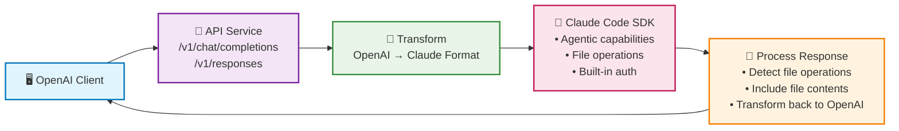

# claudecode-api

An OpenAI-compatible API service powered by Claude Code that provides agentic capabilities through traditional chat completion endpoints.

## Overview

This service acts as a bridge between OpenAI's Chat Completions API format and Claude Code's agentic capabilities. Users can use any OpenAI-compatible client to interact with Claude Code's advanced development features.

### API Processing Flow

#### Quick Overview
```
Chat/AI Client → OpenAI format API → Transform → Claude Code SDK → Process & Detect Files → Return Response
```

#### Interactive Mermaid Diagram



#### ASCII Diagram (Detailed View)

<details>
<summary>Click to expand ASCII diagram</summary>

```
┌─────────────────┐    ┌───────────────────────────────────────────────────────────────┐
│   OpenAI        │    │                   claudecode-api Service                    │
│ Compatible      │    │                                                               │
│   Client        │    │  ┌─────────────┐  ┌──────────────┐  ┌───────────────────────┐ │
│                 │    │  │   Express   │  │ Middleware   │  │     Controller        │ │
│  ┌──────────┐   │    │  │   Router    │  │              │  │                       │ │
│  │   POST   │───┼────┼──►/v1/chat/   │──►│ • Auth       │──►│ • Validate Request    │ │
│  │ /v1/chat/│   │    │  │completions  │  │ • Validation │  │ • Transform Format    │ │
│  │completion│   │    │  │             │  │ • CORS       │  │ • Generate Session ID │ │
│  └──────────┘   │    │  └─────────────┘  └──────────────┘  └───────────────────────┘ │
│                 │    │                                                               │
│  ┌──────────┐   │    │  ┌─────────────┐  ┌──────────────┐  ┌───────────────────────┐ │
│  │   POST   │───┼────┼──►/v1/responses│──►│ Same         │──►│ Same Processing +     │ │
│  │/v1/responses│   │    │  (2025 API) │  │ Middleware   │  │ Enhanced Tool Support │ │
│  └──────────┘   │    │  └─────────────┘  └──────────────┘  └───────────────────────┘ │
└─────────────────┘    └───────────────────────────────────────┬───────────────────────┘
                                                               │
                       ┌────────────────────────────────────────▼────────────────────────────────────────┐
                       │                     ClaudeCodeService                                            │
                       │                                                                                   │
                       │  ┌─────────────────────────────────────────────────────────────────────────┐    │
                       │  │              Transform OpenAI → Claude Code Format                     │    │
                       │  │  • Extract messages (system, user, assistant)                        │    │
                       │  │  • Build prompt string from conversation history                      │    │
                       │  │  • Extract system context and custom instructions                     │    │
                       │  │  • Set working directory to /public for file operations             │    │
                       │  └─────────────────────────────────────────────────────────────────────────┘    │
                       │                                       │                                          │
                       │                                       ▼                                          │
                       │  ┌─────────────────────────────────────────────────────────────────────────┐    │
                       │  │                    @anthropic-ai/claude-code SDK                       │    │
                       │  │                                                                         │    │
                       │  │  ┌─────────────────────────────────────────────────────────────┐      │    │
                       │  │  │                query() Function                               │      │    │
                       │  │  │  • Built-in authentication (no API keys needed)             │      │    │
                       │  │  │  • Advanced agentic capabilities                            │      │    │
                       │  │  │  • Tool usage (create_file, edit_files, run_command)       │      │    │
                       │  │  │  • File system operations in /public directory            │      │    │
                       │  │  │  • Permission bypass mode enabled                          │      │    │
                       │  │  │  • Returns async generator for streaming                   │      │    │
                       │  │  └─────────────────────────────────────────────────────────────┘      │    │
                       │  │                                                                         │    │
                       │  └─────────────────────────────────────────────────────────────────────────┘    │
                       │                                       │                                          │
                       │                                       ▼                                          │
                       │  ┌─────────────────────────────────────────────────────────────────────────┐    │
                       │  │                Response Processing & File Detection                     │    │
                       │  │  • Collect assistant messages and tool results                       │    │
                       │  │  • Detect file operations (create_file, edit_files)                  │    │
                       │  │  • Create before/after directory snapshots                           │    │
                       │  │  • Read modified file contents                                        │    │
                       │  │  • Generate file operation metadata                                   │    │
                       │  │  └─────────────────────────────────────────────────────────────────────────┘    │
                       └────────────────────────────────────────┬──────────────────────────────────────────┘
                                                               │
┌──────────────────────────────────────────────────────────────▼──────────────────────────────────────────┐
│                                  Response Flow                                                            │
│                                                                                                           │
│  ┌─────────────────────────────┐                    ┌─────────────────────────────────────────────────┐  │
│  │      Streaming Response     │                    │           Non-Streaming Response                │  │
│  │                            │                    │                                                │  │
│  │  ┌─────────────────────────┐ │                    │  ┌─────────────────────────────────────────────┐ │  │
│  │  │• Stream assistant msgs  │ │                    │  │• Collect complete response              │ │  │
│  │  │• Chunk response text    │ │                    │  │• Transform Claude → OpenAI format       │ │  │
│  │  │• Stream file contents   │ │                    │  │• Include file contents as code blocks  │ │  │
│  │  │• SSE format chunks      │ │                    │  │• Add usage metadata                    │ │  │
│  │  │• Send [DONE] marker     │ │                    │  │• Return complete JSON response          │ │  │
│  │  └─────────────────────────┘ │                    │  └─────────────────────────────────────────────┘ │  │
│  └─────────────────────────────┘                    └─────────────────────────────────────────────────┘  │
│                                                                                                           │
│                                   ┌─────────────────────────────────┐                                    │
│                                   │        File Operations          │                                    │
│                                   │                                 │                                    │
│                                   │  • Auto-detect created files   │                                    │
│                                   │  • Include file contents       │                                    │
│                                   │  • Syntax highlighting support │                                    │
│                                   │  • Operation type tracking     │                                    │
│                                   │  • Relative path resolution    │                                    │
│                                   └─────────────────────────────────┘                                    │
└───────────────────────────────────────────────────────────────────────────────────────────────────────┘
```

</details>

## Features

- ✅ **Real Claude Code SDK Integration** - Uses official @anthropic-ai/claude-code SDK
- ✅ OpenAI Chat Completions API compatibility
- ✅ **OpenAI Responses API (2025)** - Modern agentic API format
- ✅ Streaming responses support
- ✅ Multiple model endpoints
- ✅ Comprehensive error handling
- ✅ Request validation and authentication
- ✅ **Detailed Claude Code SDK Logging** - Complete visibility into SDK interactions
- ✅ Structured logging with Winston
- ✅ Health check endpoints
- ✅ TypeScript implementation with strict types
- ✅ **Web Management Interface** - Full-featured dashboard at `/webui`
  - 🔐 **Secure Authentication** - Role-based access control with bcrypt
  - 📊 **Real-time Analytics** - Interactive charts and live monitoring
  - 🔑 **API Key Management** - Create, manage, and track API keys
  - 📋 **Request/Response Logs** - Comprehensive logging with advanced filtering
  - ⚙️ **System Configuration** - Live configuration management
  - 🚀 **Real-time Updates** - WebSocket-powered live data updates

## Quick Start

### 1. Installation

```bash
npm install
```

### 2. Configuration

Copy the example environment file and configure your settings:

```bash
cp .env.example .env
```

Edit `.env` file:
```env
PORT=3000
NODE_ENV=development
# Claude Code uses its own built-in authentication system
# No API keys required for Claude Code SDK
OPENAI_API_KEY_REQUIRED=false
LOG_LEVEL=info
CORS_ORIGIN=*

# WebUI Configuration
SESSION_SECRET=your-secure-session-secret-here
WEBUI_DEFAULT_PASSWORD=admin123
```

**Important:** Claude Code SDK uses its own built-in authentication system. No API keys are required!
**WebUI:** The web management interface requires session configuration for security.

### 3. Development

Start the development server with hot reload:

```bash
npm run dev
```

### 4. Production

Build and start the production server:

```bash
npm run build
npm start
```

## API Endpoints

### Chat Completions

**POST** `/v1/chat/completions`

Compatible with OpenAI's Chat Completions API format. Uses Claude Code SDK under the hood for agentic capabilities.

### Responses API (2025)

**POST** `/v1/responses`

New OpenAI Responses API format for modern agentic workflows. Provides enhanced tool use and state management.

```bash
curl -X POST http://localhost:3000/v1/chat/completions \
  -H "Content-Type: application/json" \
  -H "Authorization: Bearer your-api-key" \
  -d '{
    "model": "gpt-4",
    "messages": [
      {"role": "user", "content": "Write a TypeScript function that calculates fibonacci numbers"}
    ],
    "stream": false
  }'
```

#### Responses API Example

```bash
curl -X POST http://localhost:3000/v1/responses \
  -H "Content-Type: application/json" \
  -H "Authorization: Bearer your-api-key" \
  -d '{
    "model": "o3",
    "messages": [
      {"role": "user", "content": "Create a Python web scraper for extracting product data"}
    ],
    "tools": [{"type": "code_interpreter"}],
    "stream": false
  }'
```


#### Streaming Support

```bash
curl -X POST http://localhost:3000/v1/chat/completions \
  -H "Content-Type: application/json" \
  -H "Authorization: Bearer your-api-key" \
  -d '{
    "model": "gpt-4",
    "messages": [
      {"role": "user", "content": "Explain how to implement a binary search tree"}
    ],
    "stream": true
  }'
```

### Models

**GET** `/v1/models`

List available models:

```bash
curl http://localhost:3000/v1/models \
  -H "Authorization: Bearer your-api-key"
```

**GET** `/v1/models/{model}`

Get specific model details:

```bash
curl http://localhost:3000/v1/models/gpt-4 \
  -H "Authorization: Bearer your-api-key"
```

### Health Checks

- **GET** `/health` - General health status
- **GET** `/health/ready` - Readiness probe
- **GET** `/health/live` - Liveness probe

### WebSocket

- **WebSocket** `/ws` - Real-time updates for WebUI dashboard
  - Live request monitoring
  - System metrics streaming
  - Real-time notifications

## Environment Variables

| Variable | Description | Default | Required |
|----------|-------------|---------|----------|
| `PORT` | Server port | `3000` | No |
| `NODE_ENV` | Environment mode | `development` | No |
| `OPENAI_API_KEY_REQUIRED` | Require API key auth | `false` | No |
| `LOG_LEVEL` | Logging level | `info` | No |
| `CORS_ORIGIN` | CORS allowed origins | `*` | No |
| `SESSION_SECRET` | WebUI session encryption key | `random` | Recommended |
| `WEBUI_DEFAULT_PASSWORD` | Default admin password | `admin123` | No |

**Note:** Claude Code SDK handles authentication internally - no API keys needed!
**WebUI Note:** Set `SESSION_SECRET` to a secure random string in production.

## Client Examples

### Python with OpenAI SDK

```python
from openai import OpenAI

client = OpenAI(
    api_key="your-api-key",
    base_url="http://localhost:3000/v1"
)

response = client.chat.completions.create(
    model="gpt-4",
    messages=[
        {"role": "user", "content": "Help me debug this Python error: NameError: name 'x' is not defined"}
    ]
)

print(response.choices[0].message.content)
```

### Node.js with OpenAI SDK

```javascript
import OpenAI from 'openai';

const openai = new OpenAI({
    apiKey: 'your-api-key',
    baseURL: 'http://localhost:3000/v1'
});

const response = await openai.chat.completions.create({
    model: 'gpt-4',
    messages: [
        { role: 'user', content: 'Create a React component for a todo list' }
    ],
    stream: true
});

for await (const chunk of response) {
    process.stdout.write(chunk.choices[0]?.delta?.content || '');
}
```

### cURL

```bash
# Basic request
curl -X POST http://localhost:3000/v1/chat/completions \
  -H "Content-Type: application/json" \
  -H "Authorization: Bearer your-api-key" \
  -d '{
    "model": "gpt-4",
    "messages": [
      {"role": "system", "content": "You are a helpful coding assistant."},
      {"role": "user", "content": "How do I implement authentication in Express.js?"}
    ],
    "temperature": 0.7,
    "max_tokens": 1000
  }'
```

## Supported Parameters

The API supports standard OpenAI parameters:

- `model` - Model to use (required)
- `messages` - Array of message objects (required)
- `temperature` - Controls randomness (0-2)
- `max_tokens` - Maximum tokens to generate
- `top_p` - Nucleus sampling parameter
- `frequency_penalty` - Frequency penalty (-2 to 2)
- `presence_penalty` - Presence penalty (-2 to 2)
- `stop` - Stop sequences
- `stream` - Enable streaming responses
- `user` - User identifier

## Architecture

```
src/
├── config/              # Environment configuration
├── controllers/         # API route handlers
├── middleware/          # Express middleware
├── services/            # Business logic and Claude Code integration
│   └── configService.ts # Dynamic configuration management
├── types/               # TypeScript interfaces
├── utils/               # Utilities and helpers
├── webui/               # Web Management Interface
│   ├── auth.ts         # Authentication services
│   ├── controllers.ts  # WebUI API endpoints
│   ├── database.ts     # SQLite database service
│   ├── logging.ts      # Request logging middleware
│   └── websocket.ts    # WebSocket service for real-time updates
└── app.ts               # Express application setup

webui/
├── public/
│   ├── index.html      # Web management interface
│   └── app.js          # Frontend JavaScript
└── README.md           # Detailed WebUI documentation

data/
└── webui.sqlite        # SQLite database (auto-created)
```

## Development

### Available Scripts

- `npm run dev` - Start development server with hot reload
- `npm run build` - Build for production
- `npm start` - Start production server
- `npm run typecheck` - Type checking
- `npm run lint` - Linting (placeholder)

### Database Management

The WebUI uses SQLite for data persistence:

- Database file: `data/webui.sqlite` (auto-created)
- Tables: `api_keys`, `request_logs`, `analytics`, `webui_users`
- Automatic schema initialization on startup

**⚠️ Security Note**: Database files are automatically ignored by git (`.gitignore`) as they contain sensitive user data, credentials, and API keys. Never commit database files to version control.

### Adding New Endpoints

1. Create route handler in `src/controllers/`
2. Add middleware if needed in `src/middleware/`
3. Register routes in `src/app.ts`
4. Add types in `src/types/`

### WebUI Development

1. **Backend**: Add new routes to `src/webui/controllers.ts`
2. **Database**: Update schema in `src/webui/database.ts`
3. **Frontend**: Add UI components to `webui/public/app.js`
4. **WebSocket**: Add real-time features via `src/webui/websocket.ts`

## Error Handling

The API returns OpenAI-compatible error responses:

```json
{
  "error": {
    "message": "Invalid request: missing required field 'model'",
    "type": "invalid_request_error",
    "param": "model",
    "code": "missing_required_field"
  }
}
```

## Logging

Structured JSON logging using Winston:

- Console output in development
- File output in production (`logs/` directory)
- Configurable log levels via `LOG_LEVEL` environment variable

## Security

- CORS protection with configurable origins
- Helmet.js security headers
- Request validation middleware
- Optional API key authentication
- Input sanitization

## Troubleshooting

### Common Issues

**Port already in use**
```bash
lsof -ti:3000 | xargs kill -9
```

**TypeScript compilation errors**
```bash
npm run typecheck
```

**Missing logs directory**
```bash
mkdir logs
```

## Web Management Interface

The Claude Code API includes a comprehensive web management interface accessible at `/webui`. This provides:

### 🎯 **Quick Access**
```bash
# After starting the server
open http://localhost:3000/webui

# Default login credentials
Username: admin
Password: admin123
```

### 🔐 **Security Features**
- **Secure Authentication**: bcrypt password hashing with session management
- **Role-based Access Control**: Admin and viewer roles
- **Rate Limiting**: Protection against brute force attacks
- **CSRF Protection**: Built-in security for all forms

### 📊 **Dashboard Features**
- **Real-time Monitoring**: Live API usage statistics and system health
- **Interactive Charts**: Request trends, response times, error rates
- **Recent Activity**: Live feed of API requests with status codes
- **System Metrics**: Memory usage, uptime, and performance indicators

### 🔑 **API Key Management**
- **Create & Manage Keys**: Generate secure API keys with custom settings
- **Usage Tracking**: Monitor key usage with detailed statistics
- **Rate Limiting**: Configure per-key request limits
- **Expiration Control**: Set automatic key expiry dates
- **Security**: Keys are partially masked in list views

### 📋 **Request/Response Logging**
- **Comprehensive Logging**: All API requests logged to SQLite database
- **Advanced Filtering**: Filter by date, status code, endpoint, API key
- **Real-time Updates**: Live log streaming via WebSocket
- **Detailed Inspection**: View full request/response data with syntax highlighting
- **Performance Analysis**: Response time tracking and analysis

### ⚙️ **System Configuration**
- **Live Configuration**: Update settings without server restart
- **Environment Management**: View and modify configuration variables
- **CORS Settings**: Configure cross-origin resource sharing
- **Logging Control**: Adjust log levels in real-time
- **API Security**: Toggle API key requirements

### 🚀 **Real-time Features**
- **WebSocket Integration**: Live updates without page refresh
- **Instant Notifications**: Toast notifications for all operations
- **Live Monitoring**: Real-time dashboard updates
- **Activity Streaming**: Live request monitoring

### 📱 **Modern UI/UX**
- **Responsive Design**: Works on desktop, tablet, and mobile
- **Dark Mode Ready**: Professional interface with Tailwind CSS
- **Interactive Charts**: Powered by Chart.js for rich visualizations
- **Fast Performance**: Optimized for speed with lazy loading

For detailed WebUI documentation, see [`webui/README.md`](webui/README.md).

### Debug Mode

Set `LOG_LEVEL=debug` for verbose logging including detailed Claude Code SDK interactions:

```env
LOG_LEVEL=debug
```

**Debug logging includes:**
- Claude Code SDK message details (type, UUID, content)
- Request/response transformation steps
- Token usage and processing times
- System messages and tool interactions
- Streaming chunk details
- Permission denials and error details

## Contributing

1. Fork the repository
2. Create a feature branch
3. Make your changes
4. Add tests if applicable
5. Submit a pull request

## License

MIT License - see [LICENSE](LICENSE) file for details.
